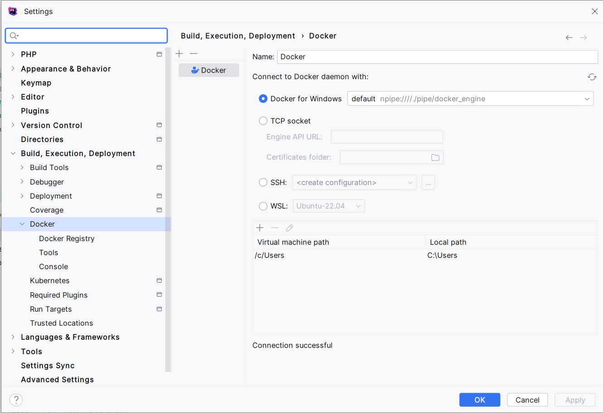
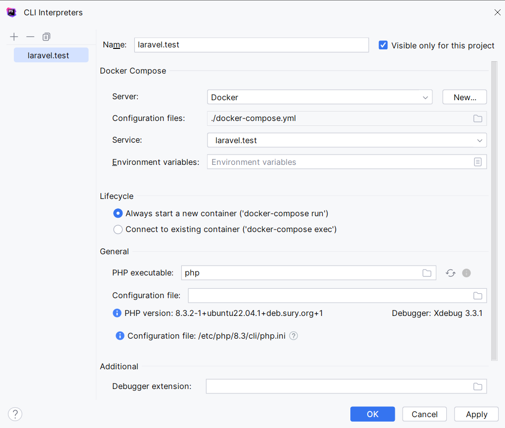
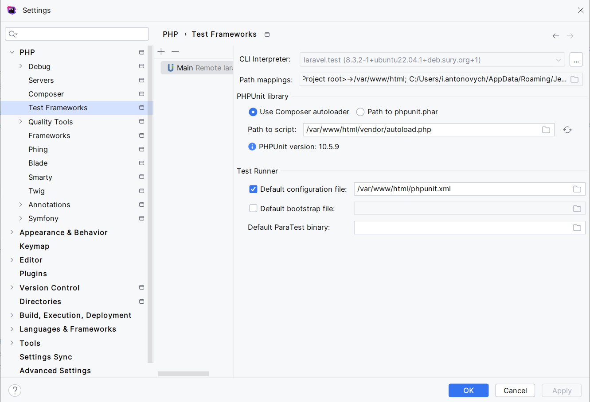
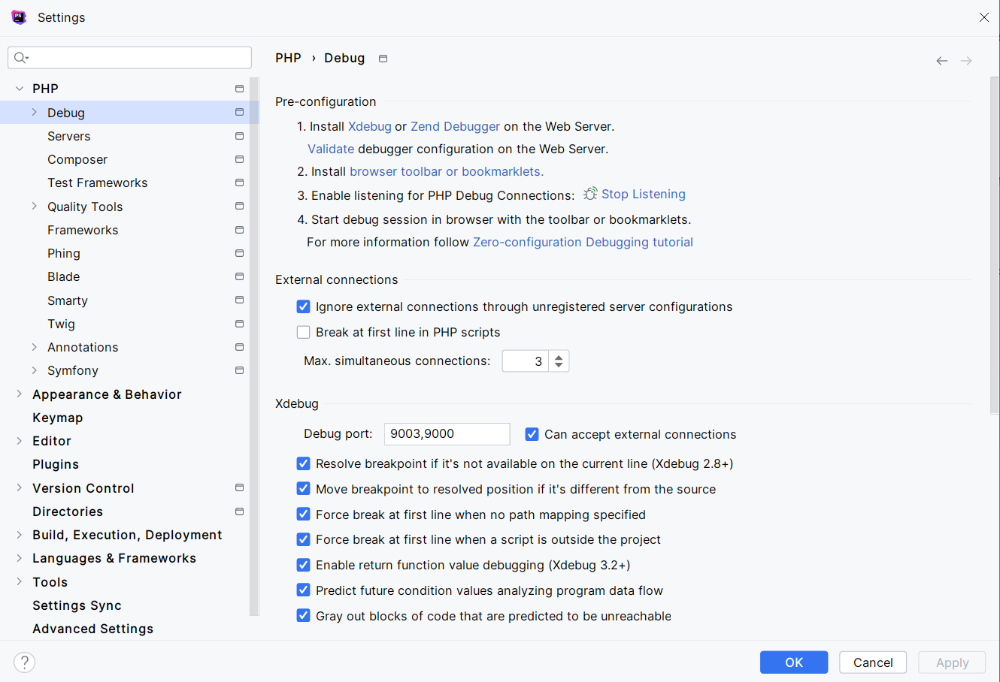
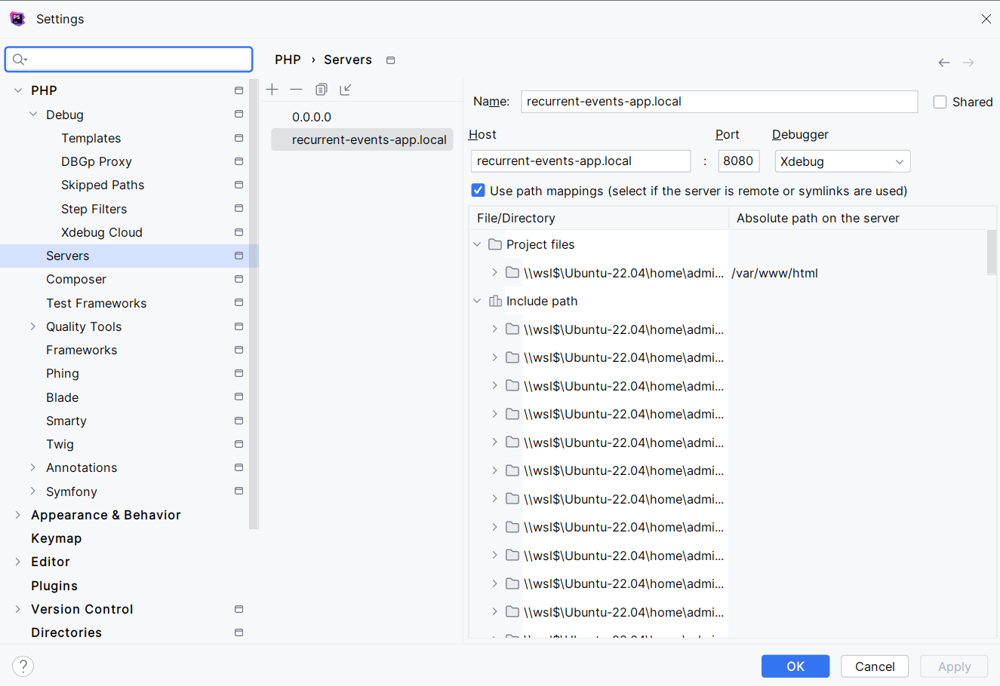

## Setup

This project uses [Sail](https://laravel.com/docs/sail).

Please install [Docker](https://www.docker.com) in order to start using Sail.

Install project dependencies:

```shell
composer install
```

Setup env:

```shell
cp .env.example .env
php artisan key:generate
```

Update hosts file:
```shell
127.0.0.1 recurrent-events-app.local
```

Startup services:

```shell
./vendor/bin/sail up -d # Up on port 8080
```

Check service status:

```
curl http://recurrent-events-app.local:8080/api/health
```

Migrate and seed database:

```shell
./vendor/bin/sail artisan migrate
./vendor/bin/sail artisan db:seed
```

### Swagger

Generate swagger page

```shell
./vendor/bin/sail artisan l5-swagger:generate
```

Open http://recurrent-events-app.local:8080/api to browse Swagger page.

## API example

### List

Route: `events.index`

```shell
curl -X 'GET' \
     'http://recurrent-events-app.local:8080/api/events' \
     -H 'Accept: application/json'
```

### Get

Route: `events.show`

```shell
curl -X 'GET' \
     'http://recurrent-events-app.local:8080/api/events/1' \
     -H 'Accept: application/json'
```

### Create

Route: `events.store`

```shell
curl -X 'POST' \
     'http://recurrent-events-app.local:8080/api/events' \
     -H 'Accept: application/json' \
     -H 'Content-Type: application/json' \
     -H 'X-CSRF-TOKEN: ' \
     -d '{
         "title": "string",
         "description": "string",
         "starts_at": "2024-01-10T10:00:00+00:00",
         "ends_at": "2024-01-10T17:00:00+00:00",
         "recurrent": false,
         "frequency": "daily",
         "repeat_until": "2024-01-10T22:00:00+00:00"
     }'
```

### Update

Route: `events.update`

```shell
curl -X 'PUT' \
     'http://recurrent-events-app.local:8080/api/events/1' \
     -H 'Accept: application/json' \
     -H 'Content-Type: application/json' \
     -H 'X-CSRF-TOKEN: ' \
     -d '{
         "title": "string",
         "description": "string",
         "starts_at": "2024-01-10T10:00:00+00:00",
         "ends_at": "2024-01-10T17:00:00+00:00",
         "recurrent": false,
         "frequency": "daily",
         "repeat_until": "2024-01-10T22:00:00+00:00"
     }'
```

### Delete

Route: `events.destroy`

```shell
curl -X 'DELETE' \
     'http://recurrent-events-app.local:8080/api/events/1' \
     -H 'Accept: application/json'
```

# Tests and code style

Validate code style

```shell
./vendor/bin/sail composer check-code
```

Run tests
```shell
./vendor/bin/sail artisan test
```

# XDEBUG

To be able to run PhpUnit in the container make sure you have the container running.

Then make sure you configure Docker:



Make sure you configure PHP with remote interpreter.



Then configure the PhpUnit interpreter.



To enable Xdebug you have to set correct debug port: 9003 - Settings -> PHP -> XDEBUG



Also need to configure server: Settings -> PHP -> Servers


